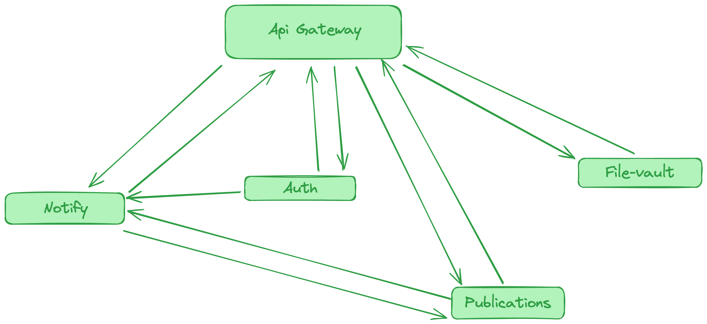

Проект «Readme»

---

## Инструкции по запуску

### 1. Создать env файлы

Создать env файлы в директориях приложений:

- project/apps/bff/.bff.env
- project/apps/publications/.publications.env
- project/apps/file-vault/.file-vault.env
- project/apps/notify/.notify.env
- project/apps/account/.account.env

Там же находятся примеры env файлов со всеми переменными, которые требуется указать.

---

### 2. Развернуть docker контейнеры

```shell
docker compose --file ./apps/publicatins/docker-compose.dev.yml --env-file ./apps/publications/publications.env --project-name "readme-publications" up -d --build

docker compose --file ./apps/file-vault/docker-compose.dev.yml --env-file ./apps/file-vault/file-vault.env --project-name "readme-file-vault" up -d --build

docker compose --file ./apps/notify/docker-compose.dev.yml --env-file ./apps/notify/notify.env --project-name "readme-notify" up -d --build

docker compose --file ./apps/account/docker-compose.dev.yml --env-file ./apps/account/account.env --project-name "readme-account" up -d --build
```



### 3. Установить npm пакеты

```
cd project
npm i
```

---

### 4. Сгенерировать клиент Prisma для publications service

```shell
npx nx run publications:db:generate
```

---

### 5. Сбросит БД postgres и произвести начальные миграции

```shell
npx nx run publications:db:reset
```

### 6 При необходимости наполнить БД publications service моковыми данными

```shell
npx nx run publications:db:seed
```

---

### 7. Запустить сервисы

```shell
npx nx run bff:serve
npx nx run publications:serve
npx nx run file-vault:serve
npx nx run notify:serve
npx nx run account:serve
```

